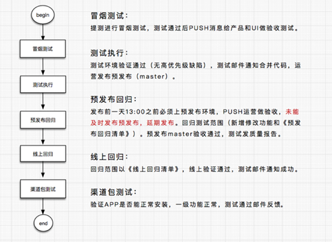

title: 测试流程规范
---

为规范公司的测试流程，保障公司研发项目的质量，提升测试与开发的工作

## 适用范围

适用于大象集团信息技术部各局

## 流程

### 需求阶段

 1. 熟悉产品需求，输出测试计划和需求疑问点
 
 2. 需求评审，确定测试计划（测试周期，提测时间，测试需求等），确定需求解决需求疑问
 
 <font color=red size=3>*PS：需求必须有原型，原型上需要注明版本的详细功能需求，APP需要有UI设计稿*</font>
 
### 开发阶段

 1. 根据最终版需求原型，测试计划，<font color=#FF7F50 size=4>**在提测前3天输出xmind格式的测试点**</font>（测试点分为3个维度：UI,功能，场景），并召集产品经理，UI，开发同学进行测试点评审
 2. 测试点评审完毕后，<font color=#FF7F50 size=4>**场景的测试点需要转成excel版测试用例并导入bugtags**</font>
 3. 测试点评审通过后，<font color=#FF7F50 size=4>**在前端（web和APP）提测前2天，输出冒烟测试用例给到对应开发**</font>
 4. 根据最终版需求原型，在开发接口定义完成之后，需要后端开发同学进行接口评审，评审结束后，测试同学<font color=#FF7F50 size=4>**需在接口提测前2天内输出冒烟测试脚本，并上传SVN**</font>

### 测试阶段

根据测试计划和需求，测试点，场景测试用例执行测试，提交对应的 bug（bug 规范和等级详见下方），bug 回归


### 上线阶段

对应测试同学需和产品经理，运营同学一起完成线上功能回归，APP 生产包需根据对应的回归清单进行功能回归


## 提测流程

 1. 根据版本排期，按时提交对应的版本
 2. 接口提测标准：<font color=#FF7F50 size=4>**版本功能已根据产品经理需求实现，接口冒烟通过，开发已完成自测**</font>
 3. 页面提测标准：<font color=#FF7F50 size=4>**版本功能已根据产品经理需求实现，页面已和接口联调通过，开发根据冒烟测试用例完成自测**</font>
 4. 提测时，需要<font color=#FF7F50 size=4>**提测平台提交提测邮件**</font>，表明<font color=#FF7F50 size=4>**具体提测的版本，对应的需要测试的功能和开发人员**</font>，具体邮件样式请见下方，<font color=#FF7F50 size=4>**在测试阶段，修复bug，或提测新功能，均需要发提测邮件**</font>
 5. 接口冒烟标准：根据小幺鸡上的接口定义，<font color=#FF7F50 size=4>**输入正常请求参数，接口返回成功，且返回对应的正确响应数据即可**</font>。（接口冒烟测试，无需校验数据库）——jmeter脚本实现
 6. 页面冒烟标准：输入正常参数，页面新增，编辑，删除，保存成功，页面不报错；APP端流程能走通，点击按钮不报错
 
### 提测邮件模板

```
- Hi, All:
- [产业管理后台] v1.4申请提测:
- 版本号: [产业管理后台] v1.4
- 代码路径:
- Jenkins 项目名称:  admin-industry-jcytestweb（必填）
- 项目分支： develop（构建分支，必填）
- 测试地址： http://test.admin.industry.jcease.com（接口和web页面的提测需要必填）
- 版本修改说明：（具体需要测试的内容及需要回归的bug，具体到功能和对应的开发人员，必填）

  1）青少年素能中心官网 - 潘峰
  2）逸健康 - 葛伟敏
  3）月子中心 （客户管理新增、修改，跟进情况，值班增加服务）- 徐宝石
  4）月子中心 （客户管理详情）- 马郭生
             
- 发布前变更配置(后台配置/脚本)：
- Sql脚本:（需要执行的sql）
```

### 测试规范

  

### 其他

- 测试环境测试通过，才可上预发测试，预发环境的回归，只做回归测试，如预发还有功能性问题，且测试环境可以复现，则属于测试漏测，算入绩效考核
- <font color=#FF7F50 size=4>**APP端，测试环境必须要做老版本测试和网络测试**</font>
- 测试环境冒烟测试通过后，APP端需输出回归清单，并上传至doc上
- 预发环境测试回归通过后，需按照项目输出质量报告，优化的项目不需要输出质量报告，只需邮件同步测试通过即可


## Bug 等级规范


<table border=0 cellpadding=0 cellspacing=0 style='border-collapse:
 collapse;table-layout:fixed;'>
 <col width=90 style='mso-width-source:userset;mso-width-alt:3185;width:67pt'>
 <col width=64 style='width:48pt'>
 <col style='mso-width-source:userset;mso-width-alt:22897;'>
 <tr>
  <td colspan=3><span lang=EN-US>Bug 等级定义标准</span></td>
 </tr>
 <tr height=106 style='mso-height-source:userset;height:79.2pt'>
  <td colspan=3 style='padding: 15px;'><span>
    1. 需求文档中要求实现的功能未实现，则算作 Bug<br>
    2. 修改的内容不符合需求文档说明，则算作 Bug<br>
    3. 修改的内容未在需求文档中指明但应当实现的功能没有实现（如表格，控制错误项），则算作 Bug<br>
    4. 修改的内容没有按照UI界面规范实现，则算作 Bug<br>
    5. 测试人员认为软件难以理解、不易使用，最终导致用户使用效果不良，则算作建议
  </span></td>
 </tr>
 <tr>
  <td colspan=3>以下做具体分析：</td>
 </tr>
 <tr>
  <td>分类范畴</td>
  <td>缺陷等级</td>
  <td>描述</td>
 </tr>
 <tr>
  <td><span
  lang=EN-US>404</span></td>
  <td rowspan=12>紧急</td>
  <td>页面出现404错误</td>
 </tr>
 <tr>
  <td>功能错误</td>
  <td>实现的功能与需求不符</td>
 </tr>
 <tr>
  <td>控制错误</td>
  <td>逻辑判断错误或未判断导致功能异常（涉钱）</td>
 </tr>
 <tr>
  <td>数据库链接错误</td>
  <td>与数据库连接方面的错误</td>
 </tr>
 <tr>
  <td>功能错误</td>
  <td>导致数据库发生死锁</td>
 </tr>
 <tr>
  <td>功能错误</td>
  <td>死循环</td>
 </tr>
 <tr>
  <td>系统问题</td>
  <td>内存泄漏,系统崩溃/死机/冻结</td>
 </tr>
 <tr>
  <td>功能错误</td>
  <td>用户数据丢失或破坏</td>
 </tr>
 <tr>
  <td>功能错误</td>
  <td>严重的数值计算错误</td>
 </tr>
 <tr>
  <td>功能错误</td>
  <td>功能设计与需求严重不符</td>
 </tr>
 <tr>
  <td>功能错误</td>
  <td>其它导致无法测试的错误</td>
 </tr>
 <tr>
  <td>部署错误</td>
  <td><span lang=EN-US>jenkins构建失败，sql执行报错</span></td>
 </tr>
 <tr>
  <td>接口错误</td>
  <td rowspan=11>高</td>
  <td>接口导致问题</td>
 </tr>
 <tr>
  <td>上传错误</td>
  <td>文件漏传、覆盖、上传错误导致问题</td>
 </tr>
 <tr>
  <td>兼容错误</td>
  <td>页面样式存在兼容性问题，严重影响页面样式及交互</td>
 </tr>
 <tr>
  <td>脚本错误</td>
  <td>脚本报错，导致正常功能无效或者无法交互</td>
 </tr>
 <tr>
  <td rowspan=2>编码（统计代码、meta顺序）错误</td>
  <td>统计代码、轨迹代码添加位置出错或漏添加、</td>
 </tr>
 <tr>
  <td><span>head标签内的meta顺序等</span></td>
 </tr>
 <tr>
  <td>功能错误</td>
  <td>功能未实现</td>
 </tr>
 <tr>
  <td>功能错误</td>
  <td>功能错误,业务流程错误或不完整</td>
 </tr>
 <tr>
  <td>功能错误</td>
  <td>系统刷新错误</td>
 </tr>
 <tr>
  <td>功能错误</td>
  <td>轻微的数值计算错误</td>
 </tr>
 <tr>
  <td>数据错误</td>
  <td><span lang=EN-US>C端后台数据显示错误</span></td>
 </tr>
 <tr>
  <td>界面错误</td>
  <td rowspan=15>普通</td>
  <td>文字或图片链接有问题，比如：链接的地址打不开，链的是其它页面</td>
 </tr>
 <tr>
  <td>兼容错误</td>
  <td>页面样式存在兼容性问题，但对页面视觉影响不大,可以正常使用</td>
 </tr>
 <tr>
  <td>脚本错误</td>
  <td>脚本报错，但对页面的正常使用不受影响</td>
 </tr>
 <tr>
  <td>界面错误</td>
  <td>界面存在文字错误,文字超长未做控制，不能全部显示的文字未加title等</td>
 </tr>
 <tr>
  <td>界面错误</td>
  <td>界面辅助说明描述不清楚，提示信息不合理、不准确等</td>
 </tr>
 <tr>
  <td>界面错误</td>
  <td>个别不影响产品理解的错别字</td>
 </tr>
 <tr>
  <td>界面错误</td>
  <td>操作界面错误(包括数据窗口内列名定义、含义是否一致)</td>
 </tr>
 <tr>
  <td>编码错误</td>
  <td>边界条件下错误&nbsp;</td>
 </tr>
 <tr>
  <td>界面错误</td>
  <td>提示信息错误(包括未给出信息、信息提示错误等)</td>
 </tr>
 <tr>
  <td>操作错误</td>
  <td>长时间操作无进度提示</td>
 </tr>
 <tr>
  <td>操作错误</td>
  <td>性能问题</td>
 </tr>
 <tr>
  <td>界面错误</td>
  <td>光标跳转设置不好，鼠标(光标)定位错误</td>
 </tr>
 <tr>
  <td>界面错误</td>
  <td>简单的输入限制未放在前台进行控制</td>
 </tr>
 <tr>
  <td>界面错误</td>
  <td>删除操作未给出提示</td>
 </tr>
 <tr>
  <td>界面错误</td>
  <td>界面样式等不规范&nbsp;</td>
 </tr>
 <tr>
  <td rowspan=5>建议类错误</td>
  <td rowspan=5>低</td>
  <td>对于交互、视觉和需求上的建议,由产品经理决</td>
 </tr>
 <tr>
  <td>定是否采纳</td>
 </tr>
 <tr>
  <td>文字排列不整齐</td>
 </tr>
 <tr>
  <td>辅助说明描述不清楚&nbsp;</td>
 </tr>
 <tr>
  <td>提示说明未采用行业规范语言</td>
 </tr>
</table>


## Bug 提交规范

#### 接口 Bug

需要贴上接口请求消息体，和响应消息体，如有日志，需要把日志截图贴出

#### WEB Bug

1. Bug 标题：【平台】【模块】XXXbug标题描述（如：【产业管理后台】【教育模块】bug描述）
2. Bug 详情：

- 【预置条件】：简单描述测试该 bug 的测试前提条件，如：账户金诚币不足，只有200
- 【测试步骤】：一般为测试用例中的测试步骤，也是你实现bug的步骤，方便开发和产品经理复现问题, 如：1）在商城列表里下单价格为200以上的商品（如需要多个步骤实现，或者一个 bug 里面需要描述多个问题，则一一描述）
- 【预期结果】：一般为预置条件和测试步骤应该呈现的测试结果。如：1.下单失败，提示账户余额不足（如有多个预期结果，则一一描述）
- 【实际结果】：  一般为预置条件和测试步骤目前呈现的测试结果，即详细的bug现象。如：1.下单成功，但是账户余额被扣减（如有多个实际结果，则一一描述）
- 【截图】：附上该 bug 的截图即可

#### APP Bug

在指定位置，把 bug 描述简洁清楚即可

